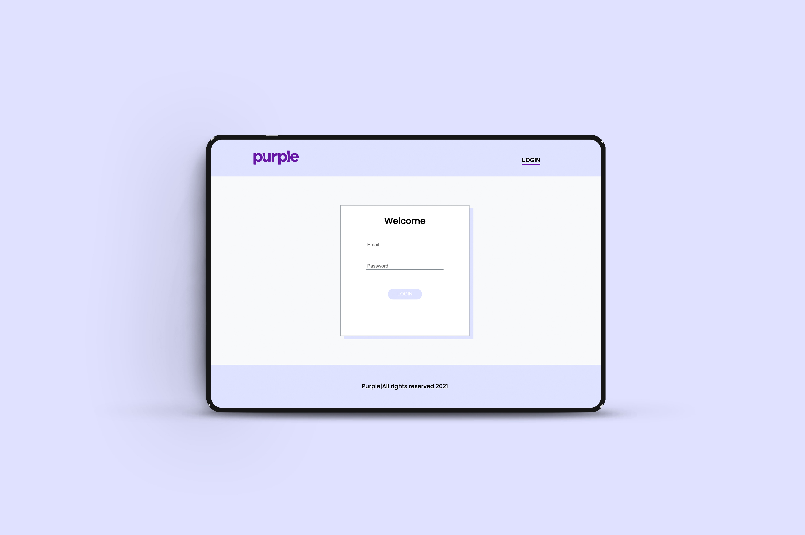
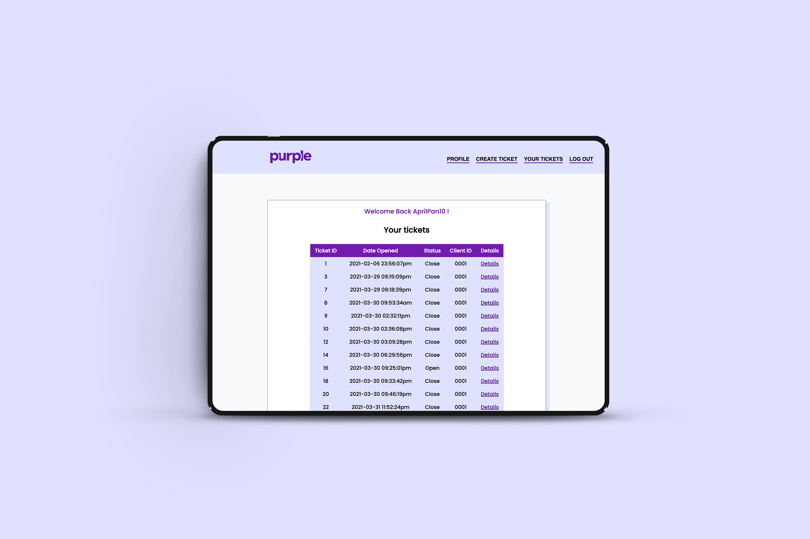
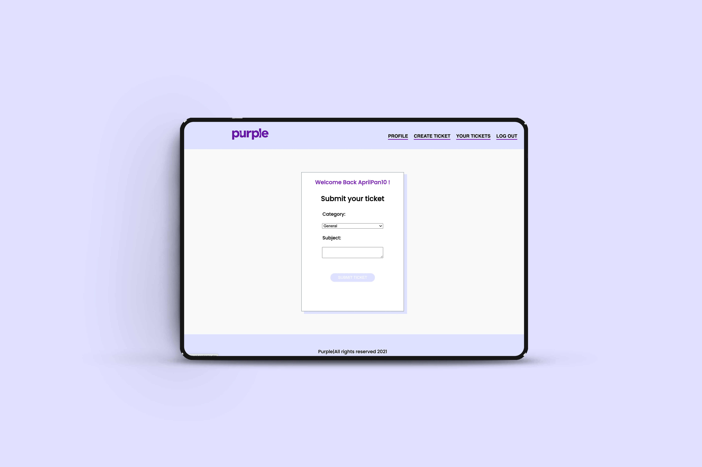
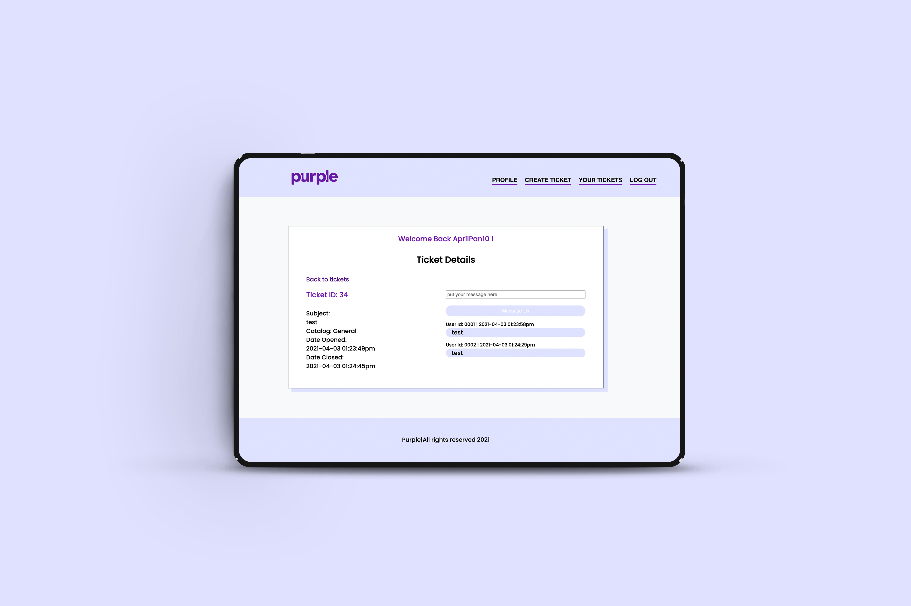
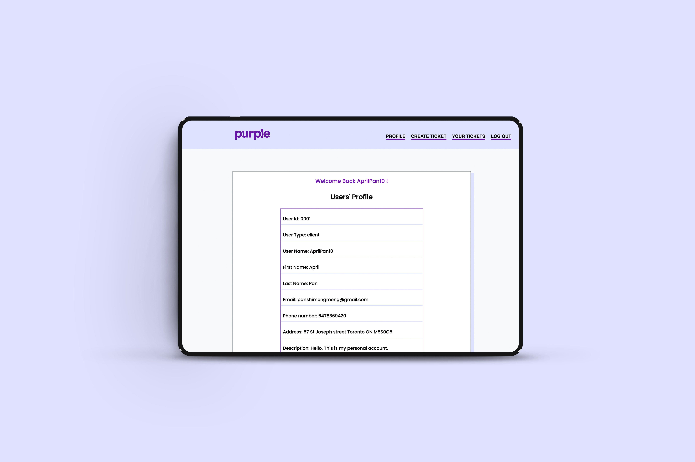

## Ticket System
## XML + PHP
- [X] Use XML and PHP to build a ticket system.
- [X] Regular users can log in and see a list of tickets they created. They can also create new tickets, view their ticket detail as well as send a message to the admin.
- [X] Admin who works in the company can log in and see all the tickets including all users, create new tickets, view tickets detail, as well as message users. Admin also can close the ticket, change the status to close.
## Future improvement
- [X] Allow users to create their own accounts.
- [X] The admin can help users create their ticket by using the original user's id.
- [X] Use Ajax to show when a new message is received.
  
- [X] Here is the live side https://shimengpan.website/Ticketsystem/views/userHome.php

 